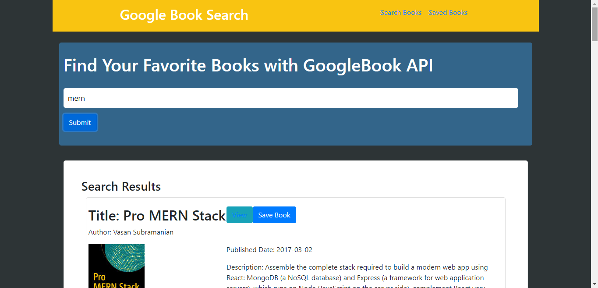

# Google Book Search App

## Overview
Google Book Search app is full MERN stack application that helps users search for their favorite book. Users can save book so later they can review books. The application uses react-router-dom to navigate the app. This app also use Node, Express js and MongoDB Atlas to save books on database.

## Google book search

 
## Deply Link
[Deploy] (https://googlesearchappp.herokuapp.com/)

## NPM Packages
* Mongoose
* Axios
* React-router-dom

## Technologies
* Node Js
* Express Js
* React Js
* MongoDB Atlas
* Bootstrap

### Author
Guillermo Lara
